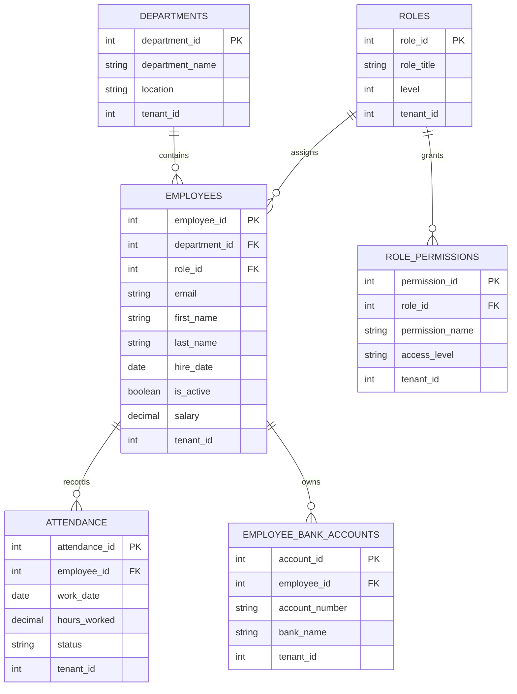

# ERD Schema

This document captures the database schema shown in the supplied diagram and stores it in the repository for reference and reuse.

## Notes
- This is the visual schema attached in the request.
- It represents a multi-tenant HR model where each table includes a `tenant_id` for tenant isolation.
- The field naming may differ slightly from the SQL seed scripts in this repository, but the conceptual structure remains the same.
